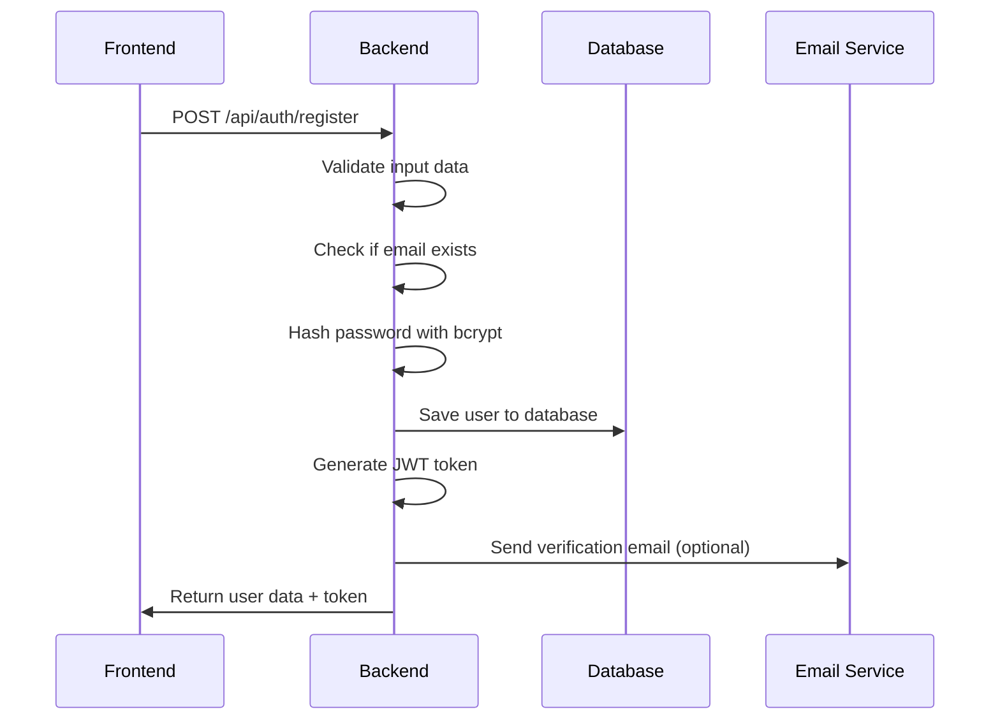
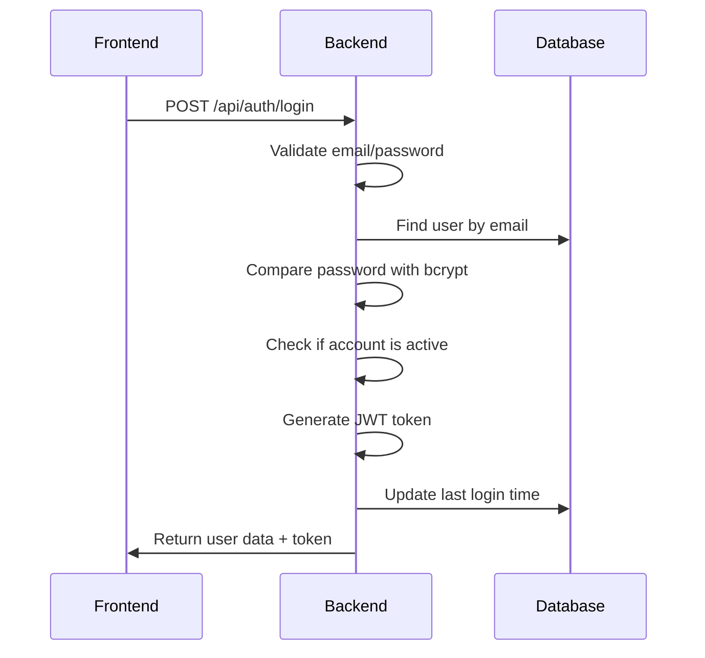
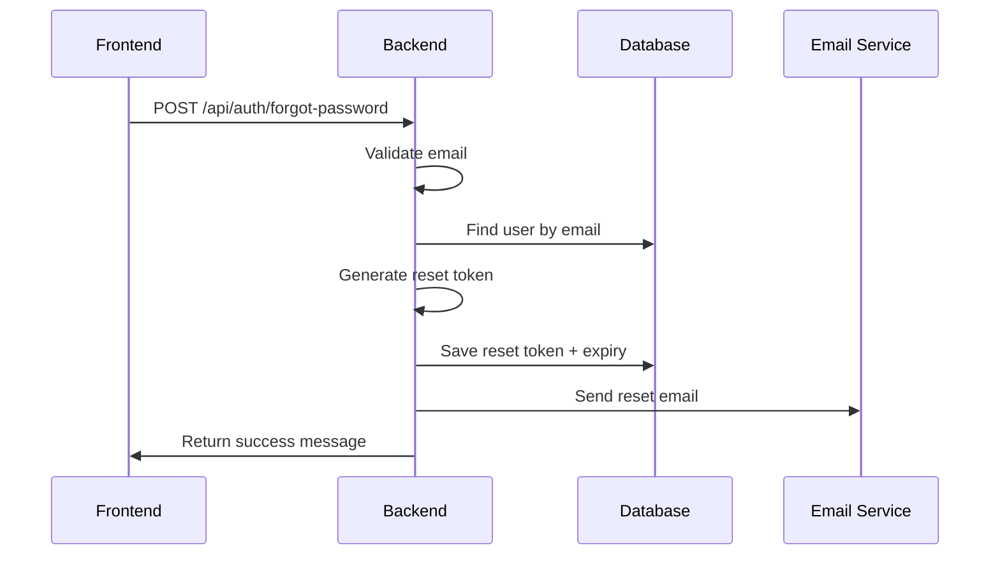
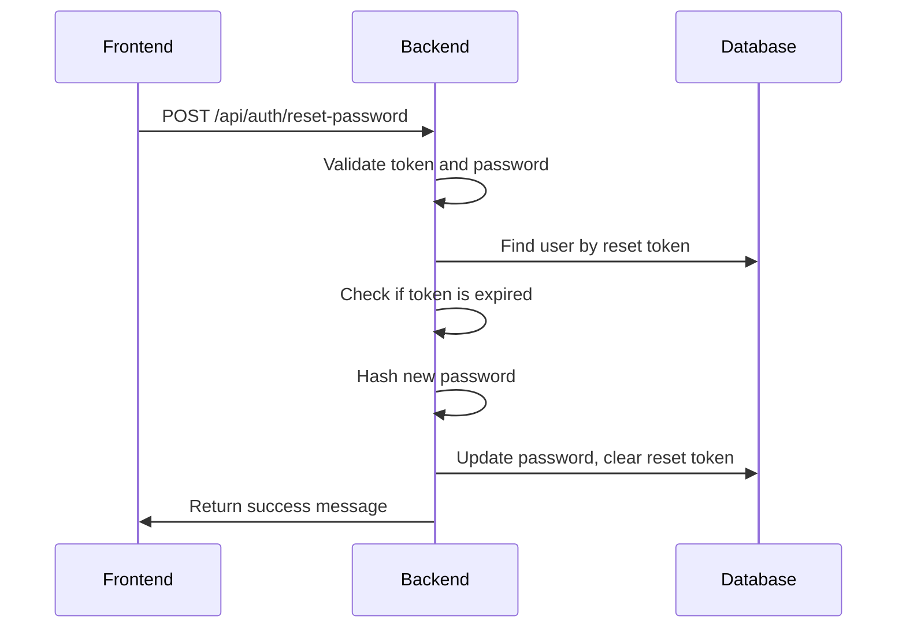

# 🔐 LocalThread Authentication & Authorization Guide

This guide explains how the authentication and authorization system works in the LocalThread backend.

## 🎯 Overview

The LocalThread backend implements a comprehensive authentication and authorization system with the following features:

### ✅ What's Implemented

1. **User Registration** - Support for Customer and Vendor roles
2. **User Login** - JWT-based authentication
3. **Password Reset** - Secure email-based password reset
4. **Email Verification** - Optional email verification system
5. **Role-Based Authorization** - Different permissions for different user types
6. **Profile Management** - Update user profiles and upload images
7. **Security Features** - Rate limiting, input validation, CORS protection

## 🏗️ Architecture Overview

```
┌─────────────────┐    ┌─────────────────┐    ┌─────────────────┐
│   Frontend      │    │   Backend API   │    │   Database      │
│   (React)       │◄──►│   (Express.js)  │◄──►│   (MongoDB)     │
└─────────────────┘    └─────────────────┘    └─────────────────┘
                              │
                              ▼
                       ┌─────────────────┐
                       │   Email Service │
                       │   (Nodemailer)  │
                       └─────────────────┘
```

## 🔐 Authentication Flow

### 1. User Registration Flow



**Example Registration Request:**
```javascript
// Customer Registration
const customerData = {
  name: "John Doe",
  email: "john@example.com",
  password: "password123",
  role: "customer",
  phone: "+1234567890"
};

// Vendor Registration
const vendorData = {
  name: "Artisan Store",
  email: "store@example.com",
  password: "password123",
  role: "vendor",
  storeName: "Handmade Crafts",
  storeLocation: "Mumbai, India",
  storeDescription: "Unique handmade products"
};
```

### 2. User Login Flow



**Example Login Request:**
```javascript
const loginData = {
  email: "john@example.com",
  password: "password123"
};
```

### 3. JWT Token Structure

```javascript
// JWT Token Payload
{
  "userId": "507f1f77bcf86cd799439011",
  "iat": 1640995200,  // Issued at
  "exp": 1641600000    // Expires at (7 days)
}
```

## 🛡️ Authorization System

### Role-Based Access Control

The system supports three user roles:

1. **Customer** (`customer`)
   - Can view products
   - Can place orders
   - Can manage their profile
   - Can view their orders

2. **Vendor** (`vendor`)
   - Can manage their products
   - Can view their orders
   - Can manage their store profile
   - Can upload store images

3. **Admin** (`admin`)
   - Can manage all users
   - Can manage all vendors
   - Can view system analytics
   - Can manage platform settings

### Authorization Middleware

```javascript
// Example usage in routes
const { authenticate, requireCustomer, requireVendor, requireAdmin } = require('../middleware/auth');

// Public route
router.get('/products', getAllProducts);

// Customer only route
router.post('/orders', authenticate, requireCustomer, createOrder);

// Vendor only route
router.post('/products', authenticate, requireVendor, createProduct);

// Admin only route
router.get('/admin/users', authenticate, requireAdmin, getAllUsers);
```

## 🔄 Password Reset Flow

### 1. Request Password Reset



### 2. Reset Password



## 📧 Email System

### Email Templates

The system includes beautiful HTML email templates for:

1. **Password Reset Email**
   - Secure reset link with 15-minute expiry
   - Professional HTML template
   - Clear instructions

2. **Email Verification**
   - Account verification with 24-hour expiry
   - Welcome message
   - Platform information

3. **Welcome Email**
   - User onboarding
   - Platform features
   - Getting started guide

### Email Configuration

```env
# Email Configuration
EMAIL_HOST=smtp.gmail.com
EMAIL_PORT=587
EMAIL_USER=your-email@gmail.com
EMAIL_PASS=your-app-password
EMAIL_FROM=noreply@localthread.com
```

## 🔒 Security Features

### 1. Password Security

- **Hashing**: Bcrypt with 12 rounds (configurable)
- **Validation**: Minimum 6 characters
- **Reset**: Secure token-based reset with 15-minute expiry

### 2. JWT Security

- **Secret**: Configurable JWT secret
- **Expiry**: 7 days (configurable)
- **Validation**: Token verification on each request

### 3. Rate Limiting

- **Window**: 15 minutes
- **Limit**: 100 requests per window
- **Protection**: Against brute force attacks

### 4. Input Validation

- **Email**: Proper email format validation
- **Password**: Minimum length and strength
- **Phone**: International phone number format
- **File Upload**: Type and size restrictions

## 📁 File Upload System

### Supported Features

1. **Profile Pictures**
   - Image format validation (JPEG, PNG, GIF)
   - Size limit: 5MB
   - Automatic old file cleanup

2. **Store Images** (Vendor Only)
   - Same validation as profile pictures
   - Role-based access control
   - Organized file storage

### Upload Configuration

```javascript
const upload = multer({
  storage: multer.diskStorage({
    destination: './uploads',
    filename: (req, file, cb) => {
      const uniqueSuffix = Date.now() + '-' + Math.round(Math.random() * 1E9);
      cb(null, file.fieldname + '-' + uniqueSuffix + path.extname(file.originalname));
    }
  }),
  limits: {
    fileSize: 5 * 1024 * 1024 // 5MB
  },
  fileFilter: (req, file, cb) => {
    const allowedTypes = /jpeg|jpg|png|gif/;
    const extname = allowedTypes.test(path.extname(file.originalname).toLowerCase());
    const mimetype = allowedTypes.test(file.mimetype);
    
    if (mimetype && extname) {
      return cb(null, true);
    } else {
      cb(new Error('Only image files are allowed!'));
    }
  }
});
```

## 🗄️ Database Schema

### User Model

```javascript
const userSchema = new mongoose.Schema({
  name: { type: String, required: true, maxlength: 50 },
  email: { type: String, required: true, unique: true },
  password: { type: String, required: true, select: false },
  role: { type: String, enum: ['customer', 'vendor', 'admin'], default: 'customer' },
  
  // Vendor-specific fields
  storeName: { type: String, maxlength: 100 },
  storeLocation: { type: String, maxlength: 200 },
  storeImage: { type: String },
  storeDescription: { type: String, maxlength: 500 },
  
  // Account status
  isActive: { type: Boolean, default: true },
  isEmailVerified: { type: Boolean, default: false },
  
  // Security fields
  emailVerificationToken: String,
  emailVerificationExpires: Date,
  passwordResetToken: String,
  passwordResetExpires: Date,
  
  // Profile fields
  phone: { type: String },
  address: {
    street: String,
    city: String,
    state: String,
    zipCode: String,
    country: { type: String, default: 'India' }
  },
  avatar: { type: String },
  lastLogin: { type: Date }
}, {
  timestamps: true
});
```

## 🚀 API Endpoints Summary

### Authentication Endpoints

| Method | Endpoint | Description | Access |
|--------|----------|-------------|--------|
| POST | `/api/auth/register` | Register new user | Public |
| POST | `/api/auth/login` | Login user | Public |
| GET | `/api/auth/me` | Get current user | Private |
| POST | `/api/auth/refresh-token` | Refresh JWT token | Private |
| POST | `/api/auth/forgot-password` | Request password reset | Public |
| POST | `/api/auth/reset-password` | Reset password | Public |
| POST | `/api/auth/verify-email` | Verify email | Public |

### User Profile Endpoints

| Method | Endpoint | Description | Access |
|--------|----------|-------------|--------|
| GET | `/api/users/profile` | Get user profile | Private |
| PUT | `/api/users/profile` | Update profile | Private |
| PUT | `/api/users/avatar` | Upload avatar | Private |
| PUT | `/api/users/store-image` | Upload store image | Vendor |
| PUT | `/api/users/password` | Change password | Private |
| DELETE | `/api/users/account` | Deactivate account | Private |
| GET | `/api/users/vendors` | Get all vendors | Public |
| GET | `/api/users/vendors/:id` | Get vendor profile | Public |

## 🔧 Frontend Integration

### 1. Store Token in Frontend

```javascript
// After successful login/registration
const handleAuthSuccess = (data) => {
  localStorage.setItem('token', data.data.token);
  localStorage.setItem('user', JSON.stringify(data.data.user));
  // Redirect to dashboard
};
```

### 2. Make Authenticated Requests

```javascript
const makeAuthenticatedRequest = async (url, options = {}) => {
  const token = localStorage.getItem('token');
  
  const response = await fetch(url, {
    ...options,
    headers: {
      'Content-Type': 'application/json',
      'Authorization': `Bearer ${token}`,
      ...options.headers
    }
  });
  
  if (response.status === 401) {
    // Token expired or invalid
    localStorage.removeItem('token');
    localStorage.removeItem('user');
    // Redirect to login
    return;
  }
  
  return response.json();
};
```

### 3. Handle Token Expiry

```javascript
// Axios interceptor example
axios.interceptors.response.use(
  (response) => response,
  (error) => {
    if (error.response?.status === 401) {
      localStorage.removeItem('token');
      localStorage.removeItem('user');
      window.location.href = '/login';
    }
    return Promise.reject(error);
  }
);
```

## 🧪 Testing the API

### 1. Test Registration

```bash
curl -X POST http://localhost:5000/api/auth/register \
  -H "Content-Type: application/json" \
  -d '{
    "name": "Test User",
    "email": "test@example.com",
    "password": "password123",
    "role": "customer"
  }'
```

### 2. Test Login

```bash
curl -X POST http://localhost:5000/api/auth/login \
  -H "Content-Type: application/json" \
  -d '{
    "email": "test@example.com",
    "password": "password123"
  }'
```

### 3. Test Protected Route

```bash
curl -X GET http://localhost:5000/api/users/profile \
  -H "Authorization: Bearer YOUR_JWT_TOKEN"
```

## 🚨 Error Handling

### Common Error Responses

```javascript
// Validation Error
{
  "success": false,
  "message": "Validation failed",
  "errors": [
    {
      "field": "email",
      "message": "Please provide a valid email"
    }
  ]
}

// Authentication Error
{
  "success": false,
  "message": "Invalid credentials"
}

// Authorization Error
{
  "success": false,
  "message": "Access denied. vendor role is not authorized to access this resource."
}

// Token Expired
{
  "success": false,
  "message": "Token expired. Please login again."
}
```

## 🔄 Next Steps

### Implemented ✅
- Complete authentication system
- Role-based authorization
- Password reset functionality
- Email verification system
- Profile management
- File upload system
- Security features

### Coming Soon 🔄
- Product management
- Order management
- Shopping cart
- Payment integration
- Real-time notifications
- Admin dashboard
- Analytics and reporting

---

**LocalThread Backend** - Secure, scalable authentication and authorization system for e-commerce platforms. 